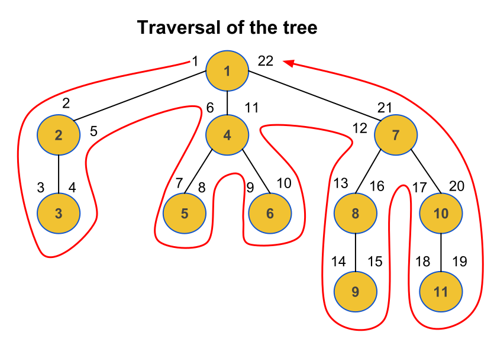

Initalize
=========

Create model with MPTT mixin:

.. code-block:: python
    :linenos:

    from sqlalchemy import Column, Integer, Boolean
    from sqlalchemy.ext.declarative import declarative_base

    from sqlalchemy_mptt.mixins import BaseNestedSets

    Base = declarative_base()

    class Tree(Base, BaseNestedSets):
        __tablename__ = "tree"

        id = Column(Integer, primary_key=True)
        visible = Column(Boolean)  # you custom field

        def __repr__(self):
            return "<Node (%s)>" % self.id

Session factory wrapper
-----------------------

For the automatic tree maintainance triggered after session flush to work
correctly, wrap the Session factory with :mod:`sqlalchemy_mptt.mptt_sessionmaker`

.. code-block:: python
    :linenos:

    from sqlalchemy import create_engine
    from sqlalchemy.orm import sessionmaker
    from sqlalchemy_mptt import mptt_sessionmaker

    engine = create_engine('...')
    Session = mptt_sessionmaker(sessionmaker(bind=engine))

Using session factory wrapper with flask_sqlalchemy
---------------------------------------------------

If you use Flask and SQLAlchemy, you probably use also flask_sqlalchemy
extension for integration. In that case the Session creation is not directly
accessible. The following allows you to use the wrapper:

.. code-block:: python
    :linenos:

    from sqlalchemy_mptt import mptt_sessionmaker
    from flask_sqlalchemy import SQLAlchemy

    # instead of creating db object directly
    db = SQLAlchemy()

    # subclass the db manager and insert the wrapper at session creation
    class CustomSQLAlchemy(SQLAlchemy):
        """A custom SQLAlchemy manager, to have control on session creation"""

        def create_session(self, options):
            """Override the original session factory creation"""
            Session = super().create_session(options)
            # Use wrapper from sqlalchemy_mptt that manage tree tables
            return mptt_sessionmaker(Session)

    # then
    db = CustomSQLAlchemy()

Events
------

The tree manager automatically registers events. But you can do it manually:

.. code-block:: python

   from sqlalchemy_mptt import tree_manager

   tree_manager.register_events()  # register events before_insert,
                                   # before_update and before_delete

Or disable events if it required:

.. code-block:: python

   from sqlalchemy_mptt import tree_manager

   tree_manager.register_events(remove=True)  # remove events before_insert,
                                              # before_update and before_delete

Data structure
--------------

Fill table with records, for example, as shown in the picture

Represented data of tree like dict

.. code-block:: python

    tree = (
        {'id':  '1',                  'parent_id': None},

        {'id':  '2', 'visible': True, 'parent_id':  '1'},
        {'id':  '3', 'visible': True, 'parent_id':  '2'},

        {'id':  '4', 'visible': True, 'parent_id':  '1'},
        {'id':  '5', 'visible': True, 'parent_id':  '4'},
        {'id':  '6', 'visible': True, 'parent_id':  '4'},

        {'id':  '7', 'visible': True, 'parent_id':  '1'},
        {'id':  '8', 'visible': True, 'parent_id':  '7'},
        {'id':  '9',                  'parent_id':  '8'},
        {'id': '10',                  'parent_id':  '7'},
        {'id': '11',                  'parent_id': '10'},
    )
Initializing a tree with data
-----------------------------

When you add nodes to the table, the tree manager subsequently updates the
level, left and right attributes in the reset of the table. This is done very
quickly if the tree already exists in the database, but for initializing the
tree, it might become a big overhead. In this case, it is recommended to
deactivate automatic tree management, fill in the data, reactivate automatic
tree management and finally call manually a rebuild of the tree once at the end:

.. no-code-block:: python

    from sqlalchemy_mptt import tree_manager

    ...

    tree_manager.register_events(remove=True) # Disable MPTT events

    # Fill tree
    for item in items:
        item.left = 0
        item.right = 0
        item.tree_id = 'my_tree_1'
        db.session.add(item)
    db.session.commit()

    ...

    tree_manager.register_events() # enabled MPTT events back
    models.MyModelTree.rebuild_tree(db.session, 'my_tree_1') # rebuild lft, rgt value automatically

After an initial table with tree you can use mptt features.
